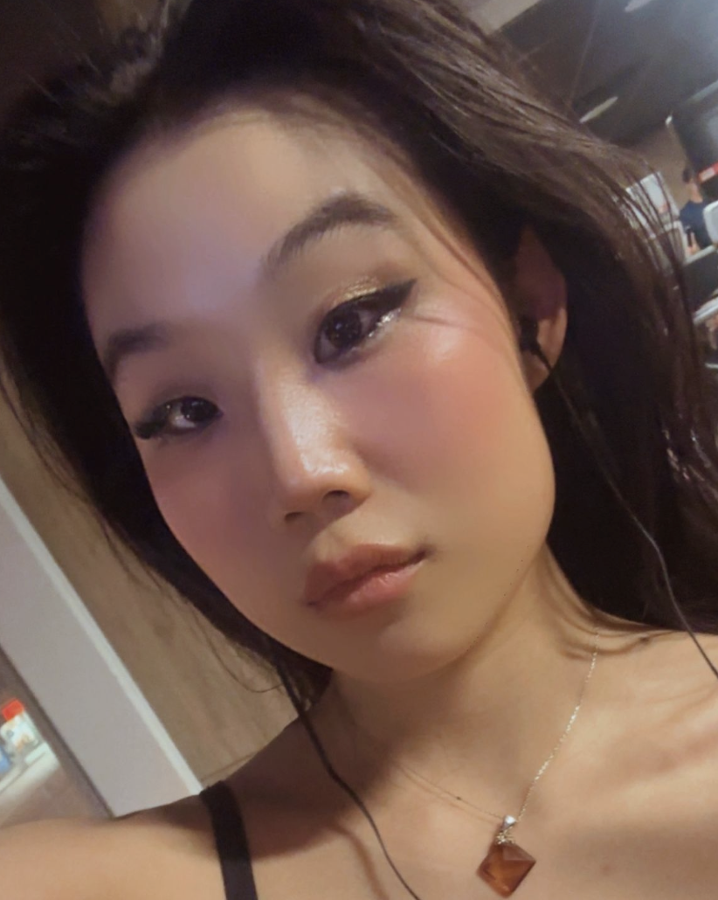
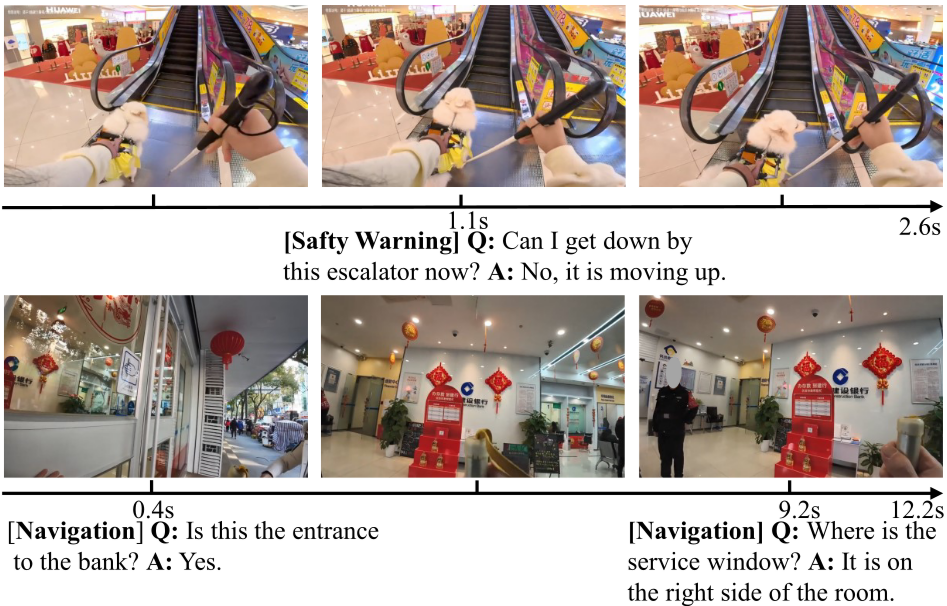

# MMAI 2026 - Julia Kim 

Welcome to my site for Modeling Multimodal AI 2026! 💜 
This repo contains my homework assignments and random thoughts throughout the class.

## Bio

Hi, I'm Julia. I'm a first-year PhD student at MIT's Operations Research Centre, working at the intersection of machine learning, interpretable AI, and educational technology. Prior to MIT, I read physics and mathematics at the University of Toronto and spent a year reading graduate mathematics at Cambridge. I'm interested in building systems that are both theoretically grounded and genuinely useful in practice.

## Final Project

<figure>
  
  <figcaption><em>Image from Xiao et al., <a href="https://arxiv.org/abs/2503.08221">"EgoBlind: Towards Egocentric Visual Assistance for the Blind People"</a> (2025).</em></figcaption>
</figure>

For my final project, I built [**EgoBlind-RA**](https://github.com/juliavekim/EgoBlind-RA/tree/main) with Xander Backus, a multimodal AI assistant that helps visually impaired users understand their physical environment through natural language, using egocentric video as input.

- **Model**: Fine-tuned Kimi-VL-A3B-Instruct on first-person footage to answer real-time queries (object identification, text reading, spatial description)
- **Training**: LLaMA-Factory on an A100 GPU, with checkpoints persisted to Google Drive
- **Key challenge**: Diagnosed and resolved a data pipeline bug in which visual frames were silently excluded from SFT training; retraining with full multimodal inputs yielded meaningful performance gains
  
## Homework
- [Homework 1 - Datasets and Preprocessing Data](./homework/homework-1/)
- [Homework 2 - Einsum + Tensors, Multimodal fusion, Contrastive Learning](./homework/homework-2/)
- [Homework 3 - Multimodal LLMsk](./homework/homework-3/)

## Website License
 This work is licensed under a <a rel="license" href="http://creativecommons.org/licenses/by-sa/4.0/">Creative Commons Attribution-ShareAlike 4.0 International License</a>.
